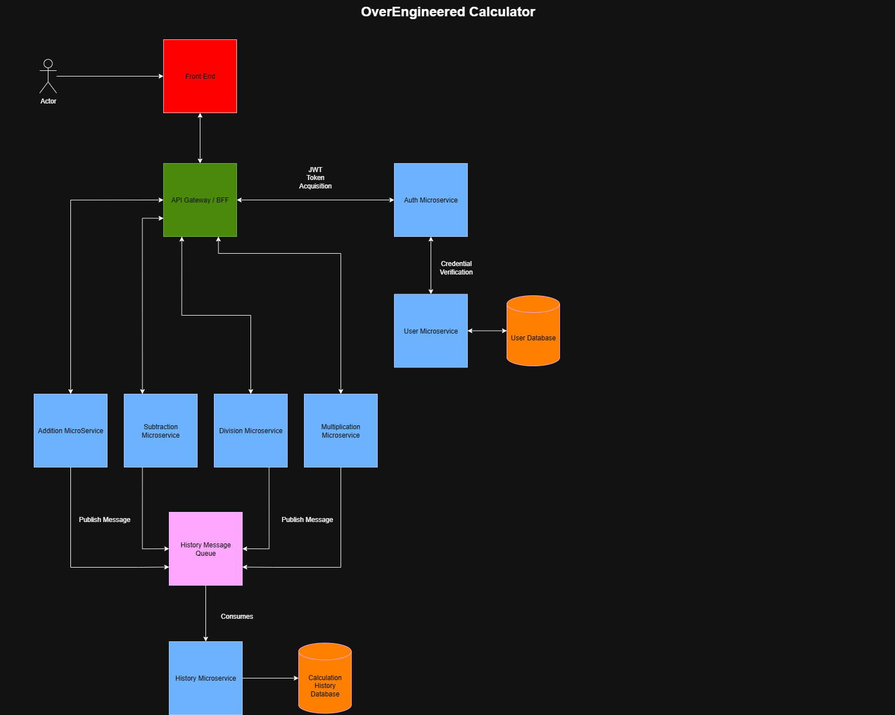
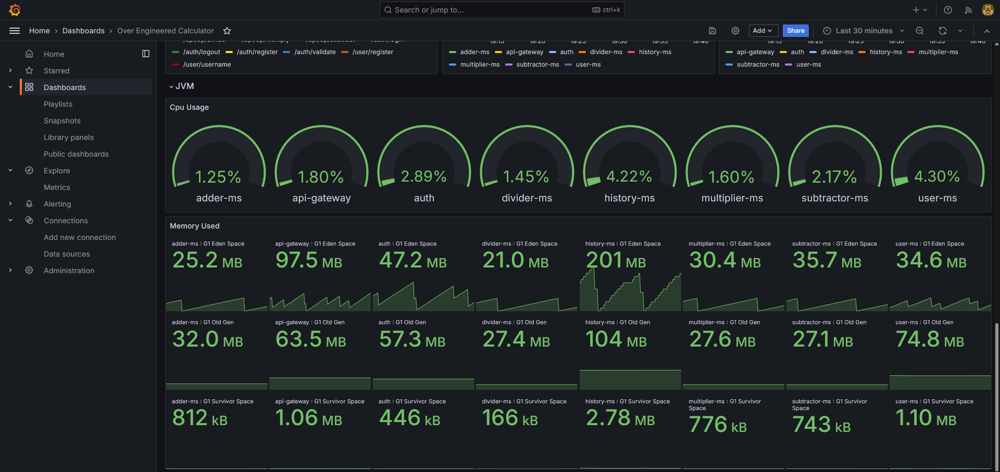
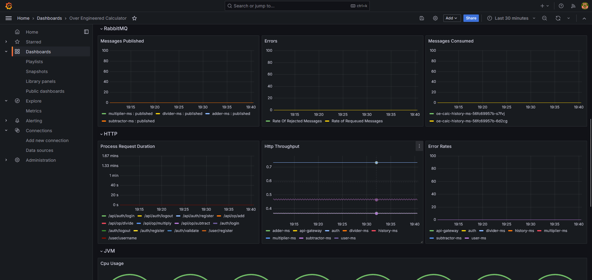
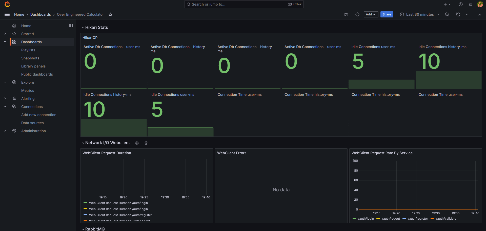
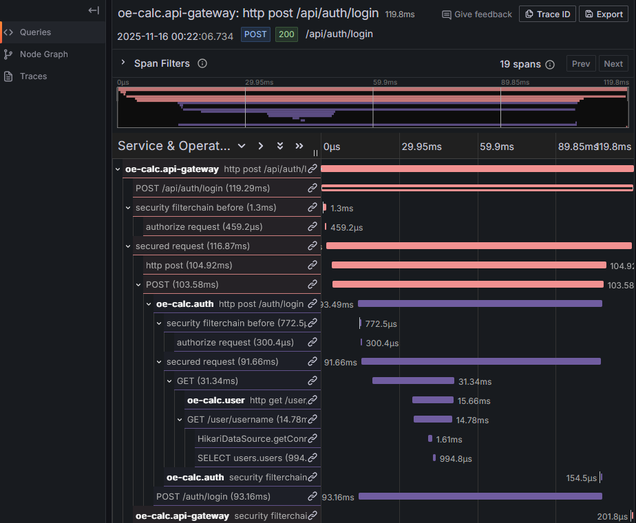
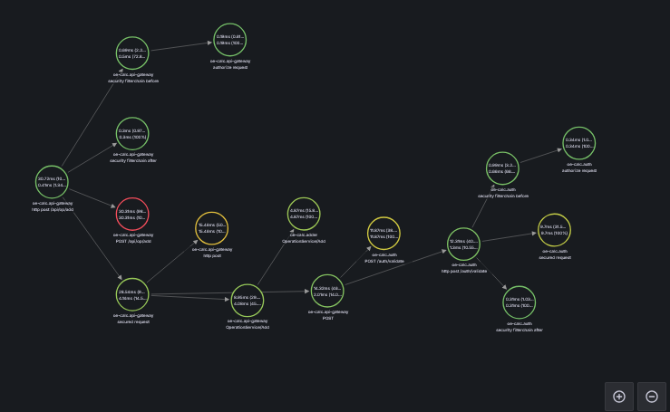

# Over-Engineered Calculator

> A microservices-based calculator that's intentionally over-engineered to learn distributed systems patterns, observability, and modern cloud-native development practices.

[![CI/CD]](https://github.com/arshwaseem/overengineered-calculator/actions)


*High-level architecture showing 9 microservices communicating via gRPC and RabbitMQ*

---

### Quick Start

Want to see it in action? Follow these steps to run the entire system locally:

### Prerequisites

- [Rancher Desktop](https://rancherdesktop.io/) (or any Kubernetes cluster)
- [Helm 3.x](https://helm.sh/docs/intro/install/)
- kubectl configured to your cluster
- 8GB RAM minimum recommended

### Installation Steps

1. **Clone the repository**
   ```bash
   git clone https://github.com/arshwaseem/overengineered-calculator.git
   cd overengineered-calculator
   ```

2. **Install CloudNativePG Operator** (for PostgreSQL databases) (Use whatever latest version is available)
   ```bash
   kubectl apply -f https://raw.githubusercontent.com/cloudnative-pg/cloudnative-pg/release-1.23/releases/cnpg-1.23.0.yaml
   ```

3. **Install the application using Helm**
   ```bash
   # Install the umbrella chart (includes all services)
   helm install calculator ./helm/overengineered-calculator
   
   # Wait for all pods to be ready (may take 2-3 minutes)
   kubectl wait --for=condition=ready pod -l app.kubernetes.io/part-of=overengineered-calculator --timeout=300s
   ```

4. **Access the services**
   ```bash
   # Get the frontend URL (port-forward for local access)
   kubectl port-forward svc/frontend 3000:3000
   
   # Access Grafana for observability
   kubectl port-forward svc/kube-prometheus-stack-grafana 3001:80
   ```

5. **Try it out!**
   - Frontend: http://localhost:3000
   - Grafana: http://localhost:3001 (admin/prom-operator)
   - Prometheus: Available through Grafana or port-forward svc/kube-prometheus-stack-prometheus

6. **Like What You See**
   - Considering hiring me or refering me to someone looking for a java developer to hire who is enthusiastic about micrsoervices and distributed systems :))

### Quick Health Check

```bash
# Check all services are running
kubectl get pods -l app.kubernetes.io/part-of=overengineered-calculator

# Check service endpoints
kubectl get svc -l app.kubernetes.io/part-of=overengineered-calculator
```

---

## What is This Project?

This is a **learning project** that takes a simple calculator and implements it as a distributed microservices system. Yes, it's deliberately over-engineered—but that's the point! 

### Why Build This?

1. **Deep Learning**: Understand distributed systems beyond tutorials
2. **Portfolio Piece**: Demonstrate knowledge of modern cloud-native practices
3. **Real-World Patterns**: Implement patterns used by Netflix, Uber, and other tech companies
4. **Hands-On Observability**: Not just theory—actually see traces, metrics, and logs in action

### What Makes It "Over-Engineered"?

Instead of a single service, we have:
- 9 separate microservices (React frontend + 8 backend services)
- Event-driven architecture with RabbitMQ
- gRPC for inter-service communication
- Database-per-service pattern with PostgreSQL
- Complete observability stack (Prometheus, Grafana, Tempo)
- Distributed tracing across all services
- CI pipeline with automated testing (Github Actions)
- Kubernetes deployment with Helm charts

### What did I miss?

If I could have implemented more things those would be:
- Continous Deployment
- End to End test suite

---

## 🏗️ Architecture Overview

### System Components

The system consists of 9 services working together:

**frontend** ( UI | React, TypeScript)
**api-gateway** ( Routing | Spring Boot, REST, gRPC, WebFlux )
**auth-service** ( JWT authentication | Spring Boot, PostgreSQL )
**user-service** ( User management | Spring Boot, PostgreSQL )
**history-service** ( Calculation history | Spring Boot, PostgreSQL, RabbitMQ )
**adder-service** ( Addition operations | Spring Boot, gRPC )
**subtractor-service** ( Subtraction operations | Spring Boot, gRPC )
**multiplier-service** ( Multiplication operations | Spring Boot, gRPC )
**divider-service** ( Division operations | Spring Boot, gRPC )

### Communication Patterns

**Synchronous (gRPC)**:
```
API Gateway → Calculator Services (Add/Sub/Mul/Div)
```
- Used for real-time calculation requests
- Port 9090 for gRPC business logic
- Port 8080 for HTTP health checks and metrics

**Asynchronous (RabbitMQ)**:
```
API Gateway → [Event: CalculationPerformed] → History Service
```
- Used for non-blocking history tracking
- Implements eventual consistency
- Enables Saga pattern for distributed transactions

### Key Architectural Decisions

#### Database-Per-Service Pattern
Each service owns its data. No shared databases.

**Why?** 
- Service autonomy and independence
- Prevents tight coupling
- Allows independent scaling and technology choices

#### Event-Driven Architecture
History tracking happens asynchronously via events.

**Why?**
- Decouples calculation from history tracking
- Calculation remains fast even if history service is slow/down
- Enables eventual consistency without distributed transactions

#### No Distributed Transactions (JTA)
Deliberately avoided JTA/XA transactions.

**Why?**
- Distributed transactions don't scale (Netflix/Uber learned this)
- Saga pattern with eventual consistency is industry standard
- Better failure handling and performance

#### gRPC for Service-to-Service
Calculator services use gRPC, not REST.

**Why?**
- Better performance (binary protocol)
- Strong typing with Protocol Buffers
- Built-in support for streaming (future-proof)
- Industry standard for microservices

---

## Observability Stack

One of the core learning objectives was implementing production-grade observability.

### The Three Pillars




*Custom Grafana dashboard showing JVM, HTTP, and gRPC metrics per service*

#### 1. Metrics (Prometheus + Grafana)
- **What**: Pre-aggregated numerical data (request rates, error rates, latencies)
- **Stack**: Spring Boot Actuator → Micrometer → Prometheus → Grafana
- **Key Insight**: 99% of metrics come automatically from Spring Boot!

**Exposed Metrics** (per service):
```
# JVM Metrics
jvm_memory_used_bytes
jvm_gc_pause_seconds
jvm_threads_live

# HTTP Metrics (REST endpoints)
http_server_requests_seconds
http_server_requests_active

# gRPC Metrics (calculator services)
grpc_server_processing_duration_seconds
grpc_server_requests_received_total
```

#### 2. Traces (OpenTelemetry + Tempo)
- **What**: Request flow across all services
- **Stack**: OpenTelemetry → Micrometer Tracing → Tempo → Grafana
- **Key Insight**: See the entire journey of a calculation request!



*Example trace showing a calculation request flowing through Gateway → Adder → History*

**Trace Propagation**:
```
User Request → API Gateway → gRPC (Adder) → RabbitMQ → History Service
     [────────────────── Single Trace ID ──────────────────]
```

#### 3. Logs (Structured Logging)
- **Format**: JSON with correlation IDs
- **Integration**: Trace IDs automatically included in logs
- **Usage**: Debug specific requests by trace ID

### Observability Configuration

**Dual-Port Architecture**:
- Port 8080: HTTP/REST + Actuator metrics endpoints
- Port 9090: gRPC business logic (calculator services only)

**Why?** Separates concerns and follows Spring Boot conventions.

**Resource Optimization** (for local development):
```yaml
# Conservative limits for laptop development
tempo:
  retention: 7 days
  storage: 1GB
prometheus:
  retention: 7 days
  storage: 5GB
```

---

## 🧪 Testing Strategy

Following the **testing pyramid** principle with emphasis on Test-Driven Development (TDD).

### 1. Unit Tests (Base Layer - Most Tests)

**Tools**: JUnit 5, Mockito, AssertJ

**Coverage**: Service logic, validation, error handling

**Example Structure**:
```java
@Test
void calculateSum_shouldReturnCorrectResult() {
    // Given
    AddRequest request = AddRequest.newBuilder()
        .setA(5).setB(3).build();
    
    // When
    AddResponse response = adderService.add(request);
    
    // Then
    assertThat(response.getResult()).isEqualTo(8);
}
```

**Naming Convention**: `methodName_shouldDoSomething`

### 2. Integration Tests (Middle Layer)

**Tools**: Testcontainers (PostgreSQL, RabbitMQ)

**Coverage**: Database interactions, messaging, external dependencies

**Key Pattern**: Real dependencies via Docker containers
```java
@Testcontainers
class HistoryServiceIntegrationTest {
    @Container
    static PostgreSQLContainer<?> postgres = 
        new PostgreSQLContainer<>("postgres:15");
    
    @Container
    static RabbitMQContainer rabbitmq = 
        new RabbitMQContainer("rabbitmq:3.12");
    
    // Tests run against real DB and RabbitMQ
}
```

### 3. End-to-End Tests (Top Layer - Planned)

**Tools**: GitHub Actions, kind (Kubernetes in Docker)

**Coverage**: Full system deployment, service-to-service integration

**Pipeline Stages**:
1. **CI**: Build + Unit Tests
2. **E2E**: Deploy to kind + Integration validation
3. **Release**: Publish artifacts

### Test Organization

Each service has three test categories:

```
src/test/java/
├── service/          # Unit tests for business logic
├── controller/       # Unit tests for REST/gRPC endpoints
└── integration/      # Integration tests with Testcontainers
```

### Coverage Reporting

**Tool**: JaCoCo

**Target**: 80%+ coverage (emphasis on critical paths)

**View Reports**: `target/site/jacoco/index.html` after `mvn test`

---

## Key Learning Outcomes

Here's what this project taught me about building distributed systems:

### 1. Respect your POM.xml

**What I Learned**:
- Leaving dependencies unchecked can cause conflicts
- Errors due to dependency conflicts are hard to pin point

### 2. Write tests with your code not after it

**What I Learned**:
- Writing Tests after your code can become tedious
- Speed takes a massive hit because change in logic also requires change in Tests which causes a lot of back and forth and wastes much time
- Always better to write tests as you write your code so that your cases are checked

### 3. Observability Isn't Optional—It's Essential

**What I Learned**:
- You can't debug what you can't see
- Distributed tracing reveals hidden bottlenecks
- 99% of metrics come free with Spring Boot Actuator
- Grafana makes patterns visible that logs never would

**The "Aha!" Moment**:
Found a performance issue in 30 seconds that would have taken hours with logs alone, was able to pinpoint exactly what method in what service was the bottle neck

### 4. Optimzation is not rocket science but rather just smartly provisioning resources and making sure your code isn't redundant

**What I Learned**:
- Leaving stray lines of code that are no longer used can add alot to your latencies
- Sometimes tweaking values for your connection pool or just enabling features like caching can work wonders for response times


### 5. Kubernetes is Complex But Necessary

**What I Learned**:
- Helm charts reduce configuration duplication massively
- Init containers solve dependency ordering elegantly
- Service discovery "just works" with Kubernetes DNS
- Resource limits prevent one service killing others

**The "Aha!" Moment**:
Deployments were made much easier with helm's rolling model


### 6. gRPC for Microservices, REST for Clients

**What I Learned**:
- gRPC is faster and strongly-typed for service-to-service
- Protocol Buffers prevent API contract drift
- HTTP/REST still better for public APIs
- Dual-port architecture separates concerns nicely

### 7. CI/CD is Development Hygiene

**What I Learned**:
- Automated testing catches regressions immediately
- Docker image tags must be branch-aware
- GitHub Actions is powerful but has a learning curve
- Manual deployments are error-prone
- You save a lot of time in the long run (way too much time)

**Pipeline Flow**:
```
Push → Build → Unit Tests → Integration Tests → Build Image → Push to GHCR
```

All automated. Failing tests block deployment.
---

## 🛠️ Development Workflow

### Local Development Setup

1. **Start Rancher Desktop** (enable Kubernetes)

2. **Install dependencies**:
   ```bash
   # Install CNPG operator
   kubectl apply -f https://raw.githubusercontent.com/cloudnative-pg/cloudnative-pg/release-1.23/releases/cnpg-1.23.0.yaml
   
   # Install monitoring stack (optional, but recommended)
   helm repo add prometheus-community https://prometheus-community.github.io/helm-charts
   helm repo update
   helm install kube-prometheus-stack prometheus-community/kube-prometheus-stack
   ```

3. **Build and deploy**:
   ```bash
   # Build all services (uses Makefile/build scripts)
   make build-all
   
   # Deploy to local Kubernetes
   helm install calculator ./helm/overengineered-calculator
   ```

**View traces in Grafana**:
1. Port-forward Grafana: `kubectl port-forward svc/kube-prometheus-stack-grafana 3001:80`
2. Open http://localhost:3001
3. Navigate to Explore → Tempo
4. Search by trace ID (found in logs)

---

## Deployment

### Local (Rancher Desktop)

Already covered in Quick Start above. Uses:
- Rancher Desktop for Kubernetes
- Helm charts for deployment
- kubectl for management

---

## 🔧 Technology Stack

### Backend Services
- **Language**: Java 17+
- **Framework**: Spring Boot 3.x.x
- **Communication**: 
  - gRPC (Spring's experimental gRPC support)
  - REST (Spring Web)
  - RabbitMQ (Spring AMQP)
- **Databases**: PostgreSQL (via CloudNativePG operator)
- **Testing**: JUnit 5, Mockito, AssertJ, Testcontainers, JaCoCo

### Frontend
- **Language**: TypeScript
- **Framework**: React
- **Build**: Vite

### Infrastructure
- **Container Runtime**: Docker
- **Orchestration**: Kubernetes (Rancher Desktop for local)
- **Package Manager**: Helm 3
- **Database Operator**: CloudNativePG

### Observability
- **Metrics**: Prometheus, Spring Boot Actuator, Micrometer
- **Visualization**: Grafana (via kube-prometheus-stack)
- **Tracing**: OpenTelemetry, Grafana Tempo, Micrometer Tracing
- **Logs**: Structured JSON logging with correlation IDs

### CI/CD
- **Platform**: GitHub Actions
- **Container Registry**: GitHub Container Registry (ghcr.io)
- **Image Tagging**: Branch-based (main, develop, feature/*, latest)

---

## 📈 Metrics and Dashboards

### Accessing Grafana

```bash
kubectl port-forward svc/kube-prometheus-stack-grafana 3001:80
```
- URL: http://localhost:3001
- User: admin
- Password: prom-operator

### Available Dashboards

1. **Service Overview** (Custom Dashboard)
   - JVM metrics per service
   - HTTP request rates and latencies
   - gRPC method durations
   - Error rates

2. **Traces** (Tempo Integration)
   - Distributed traces
   - Service dependency graph
   - Trace search by ID

---

## Contributing

This is a learning project, but contributions are welcome! Especially:

- **Bug fixes**: Found an issue? Open a PR!
- **Documentation**: Improve explanations or add examples
- **Tests**: More coverage is always good
- **Dashboards**: Share your Grafana dashboard configs

---

Special thanks to the open-source community for:
- Spring Boot and the Spring ecosystem
- Kubernetes and CNCF projects
- Grafana Labs (Grafana, Tempo)
- Prometheus project
- CloudNativePG team

---

## Contact

**Arsh Waseem**
- GitHub: [@arshwaseem](https://github.com/arshwaseem)
- Project: [overengineered-calculator](https://github.com/arshwaseem/overengineered-calculator)
- Linkedin: [@muhammadarshwaseem](https://www.linkedin.com/m/in/muhammadarshwaseem/)

---
